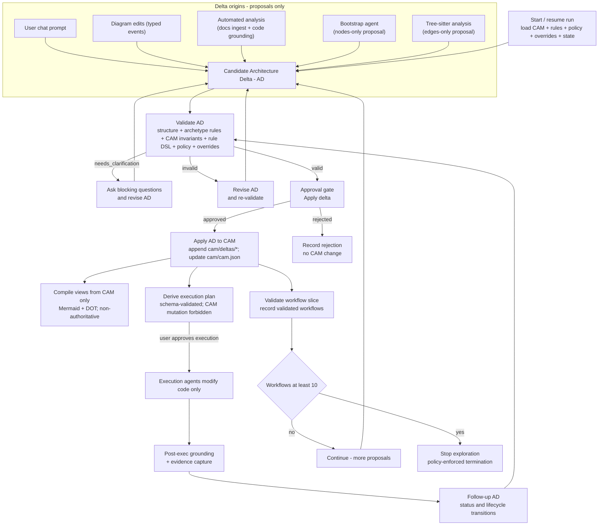

# Agentic AI Workflow (CAM + Architecture Deltas)

This project's "agentic" behavior is a **deterministic orchestrator**: the **Canonical Architecture Model (CAM)** is the only architectural source of truth, and every proposed architecture change is an explicit **Architecture Delta (AD)** that must be **validated** and (typically) **approved** before it can be applied.

## Workflow diagram

## Notes (invariants reflected above)

- **CAM is authoritative**; diagrams are **views compiled from CAM only**. Editing a view can only yield a *candidate AD* (never a silent CAM change).
- **Diagram edit modes**: **design** edits produce typed events compiled into candidate AD ops; **correction** edits are view-only (layout/labeling) and cannot change CAM structure.
- **LLMs are stateless workers**: they may propose candidate deltas or execution steps, but they do not control approval gates, state transitions, or stop conditions.
- **AD validation outcomes** are `valid | invalid | needs_clarification`; applying is blocked unless the AD is `valid` and passes the approval gate (with known-debt overrides only downgrading violations when allowed by governance).
- **Execution is gated**: execution plans are schema-validated; execution agents change code only; CAM updates happen only via a follow-up AD with validation + approval.
- **Termination** is policy-enforced when validated workflows reach the target (default `10`).
